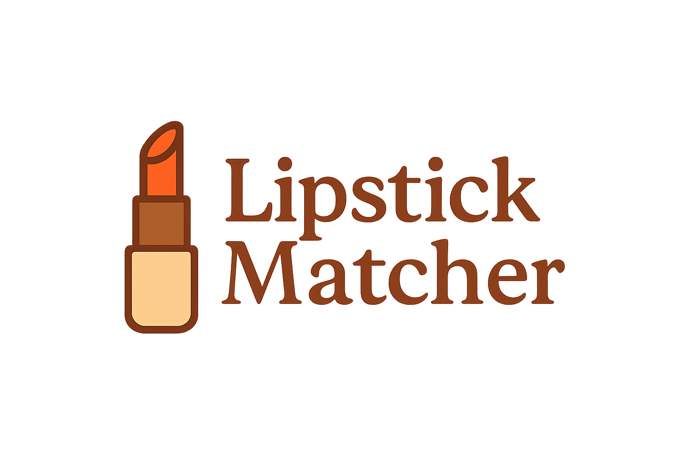

# 💄 Lipstick Matcher

A lightweight Svelte web app that matches lipstick shades based on your skin tone and undertone, using a photo upload.

<p align="center">
  
</p>

## 🚀 Features

- 📷 Upload a photo and detect skin tone
- 🎨 Detect undertone using HSL/HSV conversion
- 💡 Suggest three lipstick shades that best match your tone
- 🌈 Swatch previews and direct product links

## 🛠️ Getting Started

Clone the repo and install dependencies:

```bash
git clone https://github.com/strawberrylime99/LipstickMatcher.git
cd LipstickMatcher
npm install

Start the development server:
npm run dev

🧪 Build & Preview
npm run build       # build production version
npm run preview     # preview the production build

✨ Technologies
SvelteKit
TypeScript
HSL color processing
Skin undertone logic

📸 Models Used
face-api.js for face detection
Custom logic for skintone extraction from cheeks
